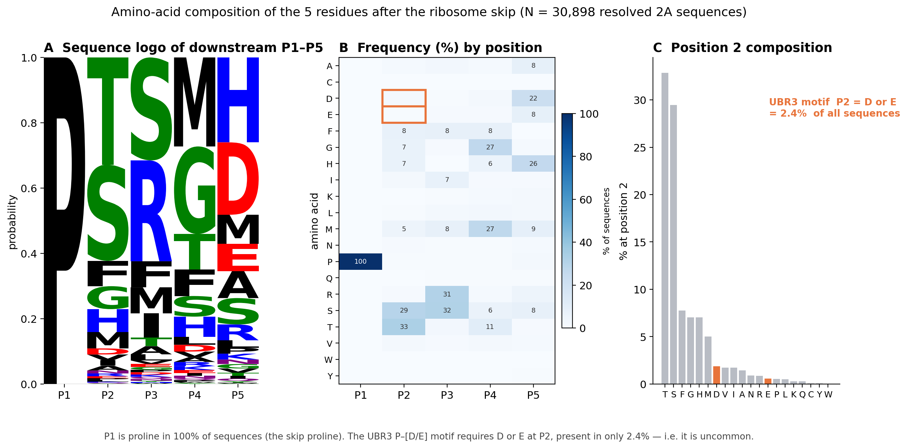

# Combined maximal 2A dataset + UBR3 P–[D/E] screen

This screens the **largest 2A dataset we can assemble** for the UBR3 downstream motif,
combining both data drops of the *same project* (Rao et al. 2025, *Cell Reports*;
its pipeline is the repo **github.com/rnabioco/2a-peptide-search** cited in the paper's
Data Availability). The two drops are:

1. **Table S2** — the paper's full published result (36,008 rows).
2. **Repo snapshot** — the committed HMMER search alignments (7,291 rows), which add
   **IMG/VR viral-metagenome hits that Table S2 does not contain**.

---

## First: "instance" vs "unique sequence" — read this

These two words count different things, and the paper (and this report) use both.

- **Instance** = *one occurrence of a 2A peptide at one specific place* — a specific
  protein (accession) at specific coordinates, in a specific organism. If the very same
  2A amino-acid sequence is found in a sea urchin, a tick, and three viruses, that is
  **5 instances**.
- **Unique sequence** = *one distinct amino-acid string*, no matter how many times or
  where it occurs. Those same 5 instances above are **1 unique sequence**.

> **Worked example.** The peptide `LLKLAGDVESNPGP` appears in 42 different proteins
> across the databases → that is **42 instances but 1 unique sequence**.

So one number (instances) measures *how much data we screened*; the other (unique
sequences) measures *how many distinct peptides* that data represents. Instances is
always the bigger number.

**One honest complication with "unique":** the two data drops trim each peptide to
slightly different lengths (e.g. `SLLKLAGDVEENPGP` vs `LLKLAGDVEENPGP` — same peptide,
different window), so our exact-string count of 3,103 slightly over-counts. It is still
the complete-set count; we just note it is an upper bound.

---

## The maximal combined dataset

| | count |
|---|---|
| **Total instances screened** (union of both drops, de-duplicated) | **38,180** |
| — from Table S2 only | 31,334 |
| — from the repo snapshot only | 2,824 |
| — found in both | 4,022 |
| by database: UniParc 30,525 · UniProt 3,044 · MGnify 2,955 · **IMG/VR 1,656** | |
| Instances with the downstream residue resolved (needed for the screen) | 35,573 (**93.2%**) |

**Distinct 2A sequences in this set: 3,103** (every different amino-acid string, counted
once). This is *our* complete set — larger than the ~2,200 the paper chose to headline,
because we keep **all** 2A sequences (including the IMG/VR viral hits, which the paper's
Table S2 omits) rather than a curated subset.

The IMG/VR viral hits (1,656 instances) are the main thing the combined set adds over
Table S2 alone — Table S2 has **no** IMG/VR content.

---

## UBR3 P–[D/E] screen result

We flag every instance whose **downstream product starts `P` and has `D` or `E` at
position 2** (`…PG↓P·[D/E]`), the UBR3 N-degron-like motif.

| | count |
|---|---|
| **UBR3 P–[D/E] instances found** | **942** |
| — position 2 = D | 726 |
| — position 2 = E | 216 |
| **Unique P–[D/E] peptide sequences** (distinct exact strings) | **280** |
| by database: UniParc 720 · UniProt 112 · MGnify 57 · **IMG/VR 53** | |
| by source: Table S2 only 729 · both 96 · **new from repo snapshot 117** | |

**Headline for your professor:**
> We assembled **every 2A sequence available across all searched databases —
> 38,180 instances (3,103 distinct sequences)** — and screened all of them.
> **942 carry the UBR3 P–[D/E] downstream motif** (280 distinct peptides; 726 with D,
> 216 with E). Including the IMG/VR viral database added **117 P–[D/E] hits, 53 of them
> viral sequences absent from the paper's published table.**

---

## Figure — downstream composition shows the UBR3 motif is uncommon

`downstream_5AA_composition.png` — amino-acid composition of the **5 residues immediately
after the ribosome skip** (P1–P5), over all **30,898** sequences with a resolved
downstream product. Three views of the same data:

- **A — Sequence logo (P1–P5).** P1 is an almost-full-height **P**: the skip proline is
  present in **100%** of sequences (built into the biology — the skip is `…G↓P`). P2–P5
  are diverse, dominated by **T, S** and others.
- **B — Frequency heatmap (20 AA × 5 positions).** The single dark cell is **P at P1
  (100%)**. The two orange boxes mark **D and E at P2** — the UBR3 residues — which are
  nearly empty.
- **C — Position-2 composition.** T (33%) and S (29%) dominate; **D (1.9%) and E (0.4%),
  in orange, are near the bottom.**

**Bottom line for your supervisor:** the UBR3 P–[D/E] motif needs D or E at position 2,
which occurs in only **2.4%** of all resolved 2A sequences — so it is genuinely uncommon,
not a default feature of 2A downstream products.

---

## What we did — full methodology

The whole pipeline, end to end, so it can be reproduced or defended:

**1. Two data sources (same project).** We combined (a) the paper's full Supplementary
Table S2 — 36,008 rows, its complete published 2A set across UniProt, UniParc and MGnify —
with (b) the committed HMMER search alignments in the paper's code repo
(`legacy/db-searches-historical/combined-class-{1,2}.sto.gz`, 7,291 aligned 2A subsequences
across UniProt, MGnify and IMG/VR). The repo's contribution is mainly the **IMG/VR viral
metagenome** hits, which Table S2 does not include.

**2. Parsing.** Table S2 rows were parsed to (database, accession, coordinates, 2A
sequence, class, origin, lineage). The repo Stockholm alignments were un-gapped to recover
each 2A subsequence and its source id (`tr|…`, `MGYP…`, `IMGVR_UViG_…`).

**3. Finding the skip site & downstream product.** Every 2A peptide ends in the conserved
`…D(V/I)E·x·N-P-G↓P` motif; the ribosome skips between the terminal **G** and **P**, so the
downstream product begins **at that proline (P1 = P, always).** We located the skip proline
by the C-terminal `PGP` and read the residue immediately after it as **P2** — the position
UBR3 recognises. For Table S2 we already had a 20-aa downstream product per row; that gives
positions P1–P5 used in the figure.

**4. Resolving missing downstream residues.** Many repo alignments stop exactly at the skip
proline, so P2 was unknown. We recovered it by re-fetching the **full source protein**:
- **UniProt / Reference Proteomes** — fetched 526 accessions via the UniProt REST API
  (`/uniprotkb/accessions`); 312 live, 214 obsolete → +375 hits resolved.
- **IMG/VR** — streamed the v7 `IMGVR_all_proteins.faa.gz` (31 GB) and matched each hit by
  its full protein id; **all 895 matched** (v7 confirmed as the search release) → +892.
- **MGnify (MGYP)** — no per-id API exists; resolving these needs the ~270 GB MGnify FASTA
  dump (`resolve_mgnify.py` is ready but not yet run). This is the remaining 6.8%.

**5. Merging into one non-redundant set.** Records from both sources were merged into
**instances** keyed by (database, accession, conserved 2A core), which absorbs the two
pipelines' slightly different trim windows so the same site is not double-counted. Result:
**38,180 instances.** A **distinct sequence** is one exact amino-acid string (**3,103**).

**6. UBR3 screen.** Each resolved instance was flagged **UBR3 P–[D/E]** if its downstream
product is P at P1 and **D or E at P2**. Result: **942 instances / 280 distinct peptides.**

**7. Organism names.** Species were fetched from UniProt (`organism_name`, `lineage`) for
the candidate accessions; IMG/VR hits are uncultivated viruses (metagenome, no Linnaean
species), MGnify hits are environmental metagenome fragments (no host).

**8. Figure.** Downstream P1–P5 composition was computed over the 30,898 instances with a
≥5-aa downstream product and rendered as a sequence logo, a frequency heatmap, and a
position-2 bar chart (`plot_downstream.py`).

---

## Files
| file | contents |
|---|---|
| `combined_all_instances.csv` | all 38,180 instances: source, db, accession, coords, 2A seq, core, pos2, UBR3 flag, downstream product, organism, lineage |
| `combined_UBR3_PDE_instances.csv` | the 942 UBR3 P–[D/E] instances with organism/species |
| `combined_UBR3_PDE_unique.csv` | the 280 unique P–[D/E] peptides, with instance counts, databases, and example organism |
| `combined_summary.json` | all counts above, machine-readable |
| `downstream_5AA_composition.png` | the figure (logo + heatmap + P2 bar) |
| `plot_downstream.py` | script that builds the figure |

## Caveats
- **Coverage:** 6.8% of instances (2,607) still lack a resolved downstream residue
  (mostly MGnify `MGYP`, which needs the ~270 GB MGnify dump). Those cannot yet be
  screened; the 942 hits are from the 93.2% that are resolved.
- **Totals reported are the complete set, not a curated subset.** "Instances" = every
  occurrence (38,180); "distinct sequences" = every different string (3,103). Both are
  bigger than the paper's headline ~2,200 because we keep everything, including IMG/VR.
- Organism/species names are filled for UniProt candidates; IMG/VR = uncultivated virus
  (metagenome), MGnify = environmental metagenome (no host assignment).
